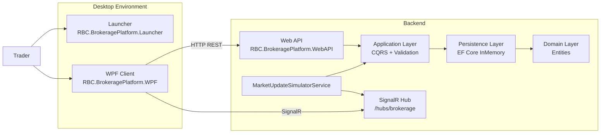
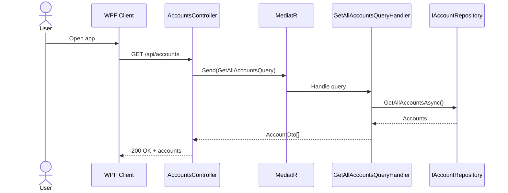
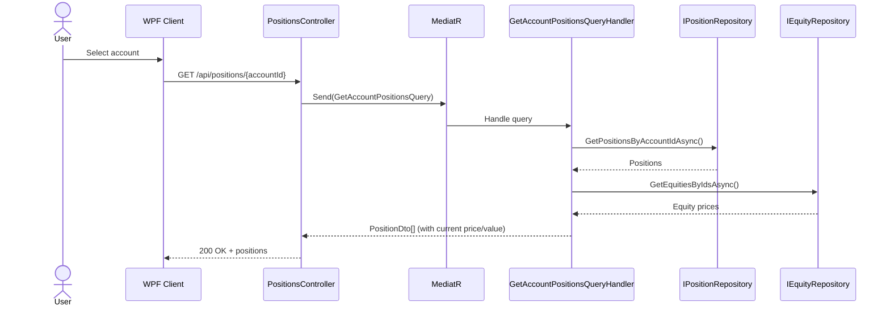
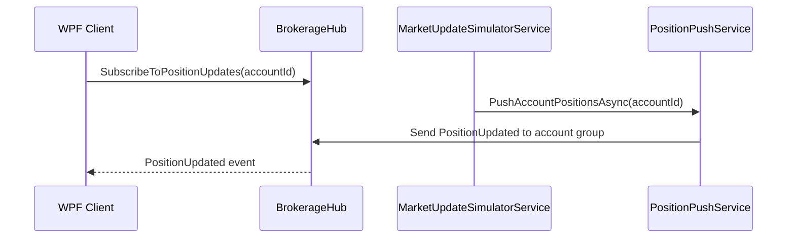
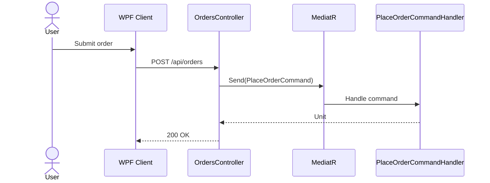

# RBC_BrokeragePlatform
Brokerage platform that traders need to view client accounts, see equity positions for a selected account, place trades, and receive live position updates from the backend as orders execute.

## Setup
- Install .NET 10.0 SDK from https://dotnet.microsoft.com/en-us/download/dotnet/10.0
- Navigate to the project directory.
- Open the solution in Visual Studio.
- Set startup projects by selecting Multiple startup projects from the Configure Startup Projects configuration.
- Build the solution and run the application using the IDE's start without debug/start,
- or run the launcher app from a published release.

## How to run

### Option 1 - Run from Visual Studio (source)
**Prerequisites**
- .NET 10 SDK installed.
- Visual Studio workload/components for:
  - `ASP.NET and web development`
  - `.NET desktop development (WPF)`

**Steps**
1. Open `src/RBC.BrokeragePlatform/RBC.BrokeragePlatform.slnx` in Visual Studio.
2. Set startup projects by selecting multiple projects startup in the Configure Startup Projects so both apps can run:
   - `RBC.BrokeragePlatform.WebAPI`
   - `RBC.BrokeragePlatform.WPF`
3. Start debugging (`F5`) or run without debugging (`Ctrl+F5`).
4. Confirm the API starts.
5. Confirm the WPF client can load accounts/positions.

### Option 2 - Run the published release (recommended)
Because of local machine security policies (see Smart Application Control note below), the most stable approach is to run the published binaries.
Execute in the Developer PowerShell the command
<br /> 
  `dotnet publish -p:PublishProfile=FolderProfile`
<br />
  
1. Go to the release directory at the same level as `README.md`:
   - `./releases` (or your local `release` folder naming if customized)
2. Run:
   - `RBC.BrokeragePlatform.Launcher.exe`
3. The launcher starts the packaged application components.

## Troubleshooting

### 1) Smart Application Control blocks execution from Visual Studio
**Symptom**
- App startup is blocked or interrupted by Windows Smart Application Control when launching from source/IDE.

**Resolution**
- Prefer running the published package via `RBC.BrokeragePlatform.Launcher.exe` from the root `releases` folder.
- If needed for local development, check Windows security policy/Smart App Control settings per your enterprise policy.

### 2) WPF client cannot reach local Web API
**Symptom**
- Client loads but API calls fail, empty data is shown, or SignalR does not connect.

**Resolution checklist**
1. Verify the Web API URL/port actually used at runtime (Visual Studio output / `launchSettings.json`).
   - Current API default: `http://localhost:5016`
2. In the **published WPF app** folder, open `appsettings.json` and align values with the running API:
   - `Api:BaseUrl`
   - `SignalR:HubUrl`
3. Example (if API runs on `5016`):

```json
{
  "Api": {
    "BaseUrl": "http://localhost:5016"
  },
  "SignalR": {
    "HubUrl": "http://localhost:5016/hubs/brokerage"
  }
}
```

## Architecture notes

### Clean Architecture implementation
The solution follows a layered structure consistent with Clean Architecture boundaries:
- `RBC.BrokeragePlatform.Domain`: core entities and domain concepts.
- `RBC.BrokeragePlatform.Application`: use cases, CQRS handlers, validation behavior.
- `RBC.BrokeragePlatform.Persistence`: EF Core data access, repositories, data seeding.
- `RBC.BrokeragePlatform.WebAPI`: HTTP endpoints + SignalR hub + background simulator.
- `RBC.BrokeragePlatform.WPF`: desktop UI client and application services.
- `RBC.BrokeragePlatform.SharedCore`: shared DTOs/enums.

### Patterns used
- **CQRS + Mediator** (`MediatR`) for query/command dispatch.
- **Repository + Unit of Work** abstractions in persistence boundaries.
- **Dependency Injection** across all projects.
- **Pipeline behavior validation** via `FluentValidation`.
- **Publish/Subscribe real-time updates** via `SignalR` groups.
- **Retry pattern** in client networking via `Polly`.
- **MVVM** in WPF using `CommunityToolkit.Mvvm`.

### Technical details (C4-style container view)


### Sequence diagrams

#### Feature 1 - Load accounts


#### Feature 2 - Load account positions


#### Feature 3 - Real-time position updates


#### Feature 4 - Place order


## Technology stack
- `.NET 10` (`net10.0` / `net10.0-windows`)
- `ASP.NET Core 10` Web API
- `WPF` desktop client
- `SignalR` for live updates
- `Entity Framework Core` (InMemory provider)
- `xUnit` + `Moq` for tests

## Libraries and versions

| Area | Library | Version |
|---|---|---|
| Application | `MediatR` | `12.5.0` |
| Application | `FluentValidation` | `12.1.1` |
| Application | `FluentValidation.DependencyInjectionExtensions` | `12.1.1` |
| Web API | `Microsoft.AspNetCore.OpenApi` | `10.0.5` |
| Persistence/Web API | `Microsoft.EntityFrameworkCore` | `10.0.5` |
| Persistence/Web API | `Microsoft.EntityFrameworkCore.InMemory` | `10.0.5` |
| WPF | `CommunityToolkit.Mvvm` | `8.4.2` |
| WPF | `Microsoft.AspNetCore.SignalR.Client` | `10.0.5` |
| WPF | `Microsoft.Extensions.DependencyInjection` | `10.0.5` |
| WPF | `Microsoft.Extensions.Http` | `10.0.5` |
| WPF | `Polly` | `8.2.0` |
| WPF | `Polly.Extensions.Http` | `3.0.0` |
| WPF | `Newtonsoft.Json` | `13.0.3` |
| WPF | `Serilog` | `4.2.0` |
| WPF | `Serilog.Extensions.Logging` | `9.0.2` |
| WPF | `Serilog.Sinks.File` | `6.0.0` |
| Tests | `xunit` | `2.9.2` |
| Tests | `Moq` | `4.20.72` |
| Tests | `Microsoft.NET.Test.Sdk` | `17.14.1` |
| Tests | `coverlet.collector` | `6.0.4` |

## Chronological pertinent prompts implemented (top 5)
1. Migrate solution projects and dependencies to `.NET 10` target frameworks.
2. Implement Clean Architecture layering (`Domain`, `Application`, `Persistence`, `Presentation`).
3. Introduce CQRS handlers with `MediatR` and validation pipeline (`FluentValidation`).
4. Add real-time position streaming using `SignalR` hub + WPF subscription groups.
5. Harden client communication with retry policies (`Polly`) and structured logging (`Serilog`).

## Future roadmap
- **UI enhancement roadmap**
  - Improve desktop UX, account navigation, and data visualization components.
  - Add richer feedback for order lifecycle and connection status.
- **Market data roadmap**
  - Replace market simulation service with real market data API integration.
- **Data persistence roadmap**
  - Replace random/in-memory data with a real database schema.
  - Introduce migrations and environment-specific deployment workflows.
- **Cloud modernization roadmap**
  - Leverage cloud infrastructure for API hosting, managed database, observability, and secure configuration management.
